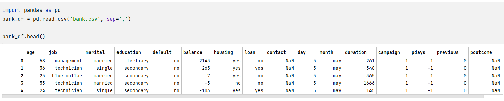
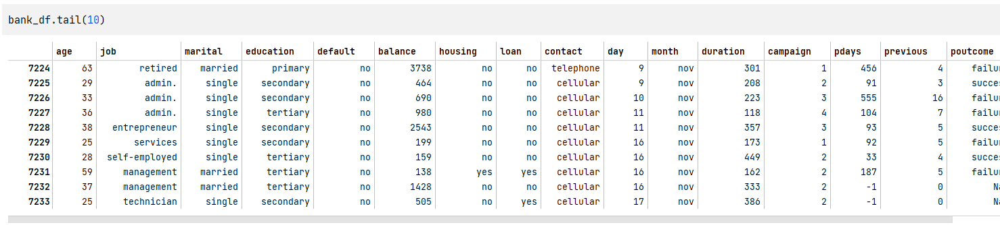
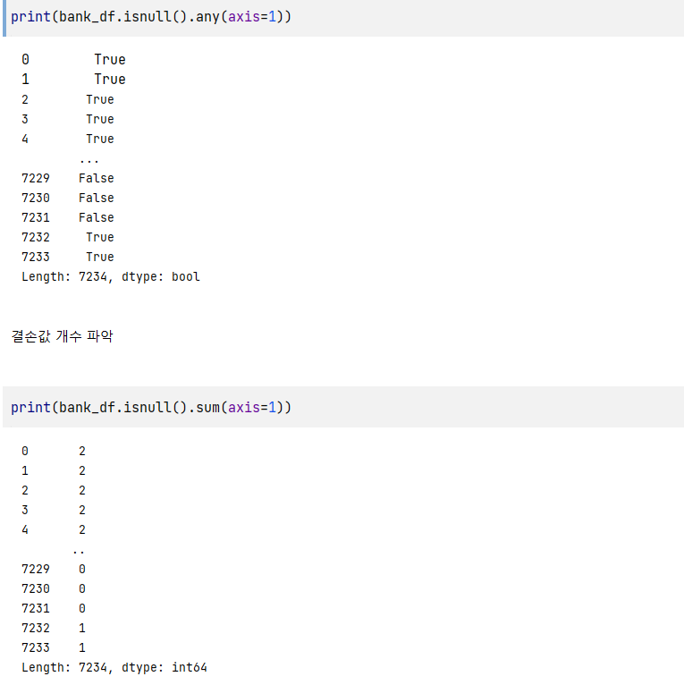
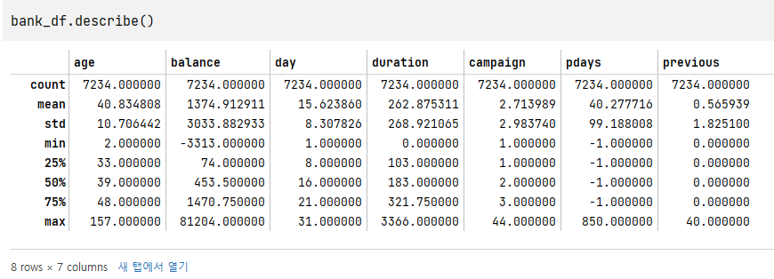
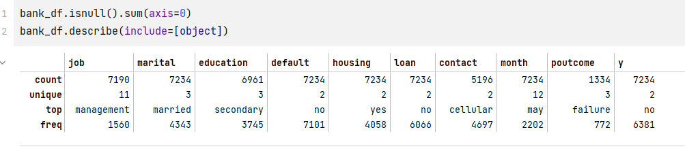

# python-data-analysis
파이썬 데이터 분석 공부
# 3장 정형데이터 전처리
##1. 데이터 이해
###1. 실행 환경
###2. 데이티 읽기와 확인
    pandas는 데이터 값을 read_csv()파일로 확인을 한다.
1. 최상단에 있는 데이터를 보여주는 메소드 => head()

2. 하단에 있는 데이터를 보요주는 메소드 => tail()

3. 데이터의 갯수, 타입을 알려주는 메소드 => shape, dtypes

###3. 결손값확인
    결손값이란 데이터 구조안에 null, 이상한 값들을 의미한다.
1. 결손값 확인에는 any, sum이 있는데, any는 논리타입, sum은 빈 값의 갯수를 알려준다.

연습문제 : 결손값이 많은 순으로 표현하시오

###4. 통계량 계산
    통계량은 describe 메소드를 사용해 평균값, 표준편차등 통계적에 필요한 정보들을 알려준다.
1. count, std, min, max, 25%, 50%, 75%, max

2. 용어 정리
   1. 건수 : 데이터 건수
   2. 합계치 : 데이터값을 모두 합한 값
   3. 평균치 : 합계값을 데이터 건수로 나눈 값
   4. 표준편차 : 데이터 분포를 표현한 값
   5. 최대치 : 데이터 중에서 가장 큰 값
   6. 최소치 : 데이터 중에서 가장 작은 값
   7. 중앙치 : 데이터를 정렬했을 때 중간 값
   8. 최빈치 : 데이터 중에서 가장 자주 나타나는 값
   9. 사분위수 : 데이터를 오름차순으로 정렬했을 때 네 개로 분할한 경계값

   
3. 연습문제 : 문자형 (Object) 항목에 대해 통계값을 계산하시오

###5. 데이터 시각화-1
###6. 데이터 시각화-1